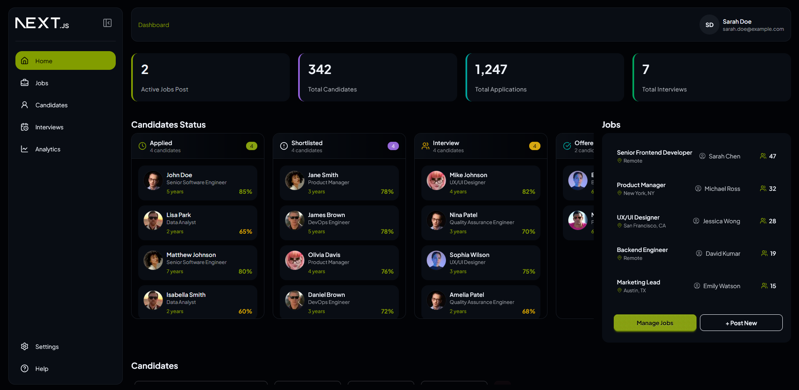
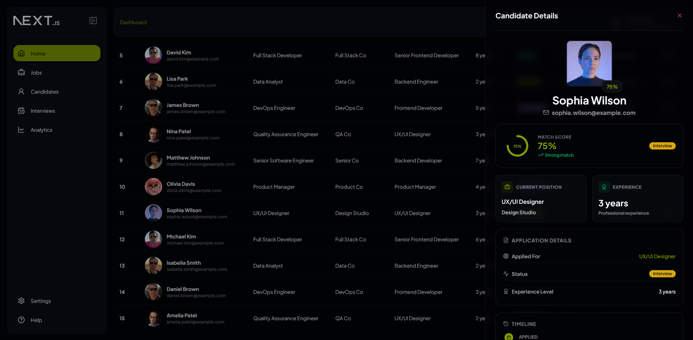
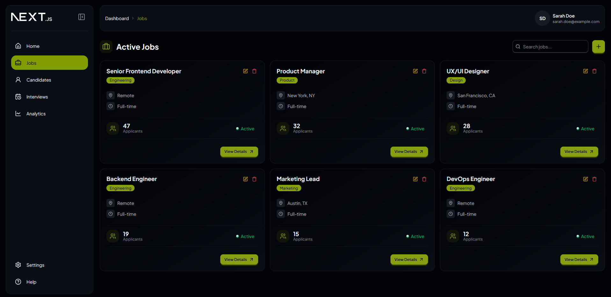
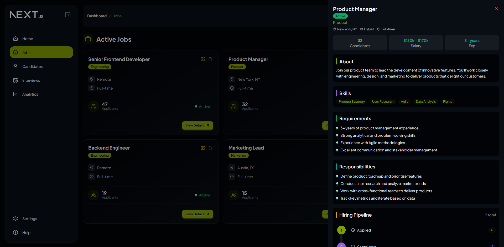
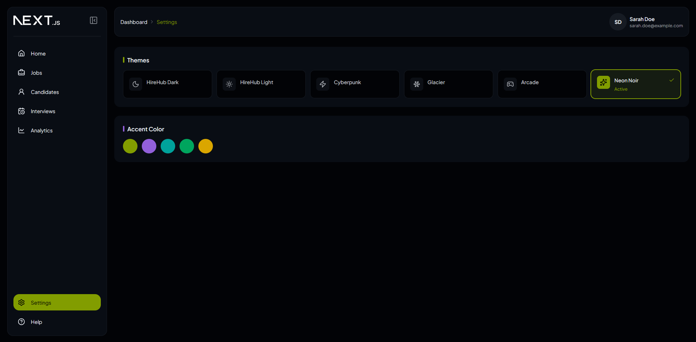

# Candidate Pipeline Dashboard

A modern, responsive frontend for a recruitment SaaS platform, built as part of an assignment.

---

## 📸 Screenshots

### Dashboard

### Candidate Details

### Posted Jobs

### Posted Job Details

### Customize Themes

---

## 🚀 Live Demo  
👉 [View Live Application](https://pipeline-dashboard-gamma.vercel.app)

## 📂 Source Code  
👉 [GitHub Repository](https://github.com/lavleshdubey90/pipeline-dashboard.git)

---

## 🛠️ Tech Stack

- Next.js
- React
- TypeScript
- Tailwind CSS
- DaisyUI
- Zustand (state management)
- Lucide Icons

---

## ✨ Features

### 🧩 Core Layout
- Responsive layout with:
  - Collapsible sidebar
  - Top header with breadcrumbs
  - Main content area

### 📊 Dashboard
- Statistics cards for quick insights
- Kanban-style candidate pipeline with drag-and-drop
- Active jobs section
- Candidates table with detailed information

### 👥 Candidate Management
- Candidate table includes:
  - Name
  - Role/Company
  - Experience
  - Match score
  - Status
  - Last activity
- Filters:
  - Search by name/email
  - Filter by stage
  - Filter by experience
  - Filter by score range

### 📄 Candidate Details
- Sidebar drawer with:
  - Profile information
  - Skills/tags
  - Experience and score
  - Application timeline
  - Structured details view

### 🎨 UI/UX
- Clean, modern B2B SaaS design
- Dark theme by default
- Theme switcher (via Settings page)
- Fully responsive across devices

---

## 📦 Additional Pages (Extended Scope)

> These were added to demonstrate scalability and product thinking.

- **Jobs Page**
  - Card-based job listings
  - Click to view detailed job sidebar

- **Settings Page**
  - Theme customization

- **Navigation**
  - Dashboard (default)
  - Jobs
  - Candidates (placeholder)
  - Settings

---

## 🔒 Type Safety

- Fully type-safe application using TypeScript
- Consistent data modeling across components
- Mock data used (no backend provided)

---

## ⚙️ State Management

- Zustand used for lightweight and scalable state handling

---

## 🧪 UI States Covered

- Loading state
- Empty state
- No results state

---

## 🧠 Approach

The focus of this project was to build a clean, intuitive, and scalable B2B SaaS interface.

Key considerations:
- Component reusability
- Clear visual hierarchy
- Smooth user interactions (e.g., drag-and-drop)
- Responsive design
- Maintainable code structure

---

## 🚧 What I Would Improve

Given more time, I would:

- Integrate a real backend (APIs & database)
- Add authentication and user roles
- Improve accessibility (ARIA, keyboard navigation)
- Enhance filtering/sorting capabilities
- Add animations and micro-interactions
- Write unit and integration tests

---

## ⚠️ Notes

- Mock data is used due to absence of backend
- Some pages (Candidates, full Jobs flow) are partially implemented
- Help/404 page intentionally not included
- This project was built as part of an assignment

---

## 📬 Feedback

I’d love to hear your feedback!  
Feel free to reach out with any suggestions or improvements.